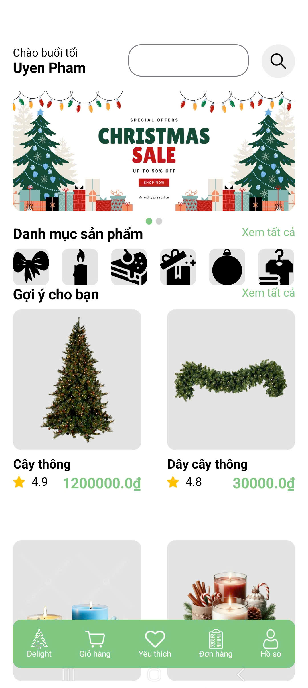

# 🎄 Delight Ordering App (Android - Kotlin & Java)

A feature-rich mobile application developed using **Kotlin** and **Java**, designed to provide a seamless and festive shopping experience for Christmas. The app leverages **Firebase Realtime Database** for real-time data management and synchronization.

  

## ✨ Key Features

### 1. 🔐 User Authentication
- Secure **Login**, **Register**, and **Forgot Password** functionalities.
- Integration with **Firebase Authentication** for user verification.

### 2. 🛍️ Product Browsing & Shopping
- Users can view a wide range of Christmas products.
- Add products to **Shopping Cart** or **Favorites**.
- Smooth navigation and product detail views.

### 3. 🛒 Order Management
- Customers can **create orders** directly from their cart.
- Track real-time **order status** (processing, shipping, delivered).
- Order history for reordering or reference.

### 4. ❤️ Favorites
- Save favorite products for quick access.
- Easily add/remove items from Favorites.

### 5. ⏳ Countdown to Christmas
- Festive **countdown timer** to Christmas Day.
- Adds seasonal excitement and engagement.

## 🛠️ Technologies Used

- **Kotlin**
- **Java**
- **Firebase Realtime Database**
- **Android SDK**
- **Material UI Components**

## 📱 Screens Overview

- Login & Registration screens  
- Home page with product categories  
- Product detail screen  
- Shopping cart & checkout  
- Order tracking  
- Favorites list  
- Christmas countdown screen  

## 👩‍💻 Developed By
**Phạm Thị Phương Uyên**  
Student at **University of Finance - Marketing (UFM)**  
Major: **Management Information Systems**  

---

